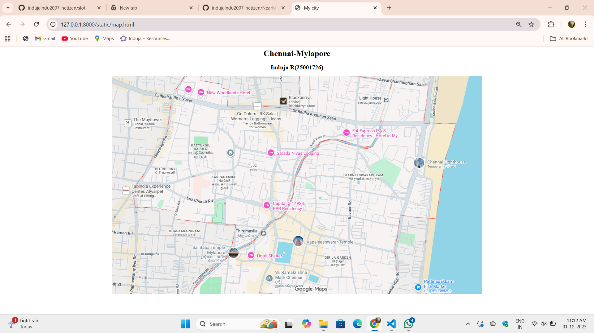

# Ex03 Places Around Me
## Date: 

## AIM
To develop a website to display details about the places around my house.

## DESIGN STEPS

### STEP 1
Create a Django admin interface.

### STEP 2
Download your city map from Google as an image.

### STEP 3
Insert the image using `````` tag and link it to the map.

### STEP 4
Using ```<map>``` tag name the map.

### STEP 5
Create clickable regions in the image using ```<area>``` tag.

### STEP 6
Write HTML programs for all the regions identified.

### STEP 7
Execute the programs and publish them.

## CODE
map.html
```
<html>
    <head>
        <title>My city</title>
    </head>
    <body align="center">
        <h1 align="center"><b>Chennai-Mylapore</b></h1>
        <h2 align="center"><b>Induja R(25001726)</b></h2>
        

<map name="image-map">
    <area target="" alt="Kabaleeshwarar temple" title="Kabaleeshwarar temple" href="temple.html" coords="675,612,952,675" shape="rect">
    <area target="" alt="Sri Ramakrishna Math Center" title="Sri Ramakrishna Math Center" href="centre.html" coords="611,743,567,793,627,835,771,821,784,734" shape="poly">
    <area target="" alt="Marina Lighthouse" title="Marina Lighthouse" href="lighthouse.html" coords="1195,343,106" shape="circle">
    <area target="" alt="New woodlands hotel" title="New woodlands hotel" href="hotel.html" coords="325,43,542,90" shape="rect">
    <area target="" alt="Lighthouse Railway Station" title="Lighthouse Railway Station" href="railway.html" coords="1008,57,1082,79,1079,134,942,135,940,80" shape="poly">
</map>
    </body>
</html>
```
temple.html
```
<html>
    <head>
        <title>Kabaleeshwarar Temple</title>
    </head>
    <body bgcolor="purple">
        <h1 align="center">
            <font color="red"><b>Chennai-Mylapore</b></font>
        </h1>
        <h3 align="center">
            <font color="white" size="5" face="Cooper Black"><b>Kabaleeshwarar Temple</b></font>
        </h3>
        <hr color="black" size="3">
        <p align="justify">
            <font face="Lucida Handwriting" size="10" color="yellow">
                Kapaleeshwarar Temple, located in Mylapore, Chennai, is a famous ancient Hindu temple dedicated to Lord Shiva.It is known for its magnificent Dravidian architecture, featuring a towering, colorful gopuram (gateway tower).The temple is a vibrant cultural and spiritual center, especially during the Panguni Peruvizha festival, which attracts thousands of devotees.


            </font>
        </p>

    </body>
</html>

```
railway.html
```
<html>
    <head>
        <title>Railway Station</title>
    </head>
    <body bgcolor="lavender">
        <h1 align="center">
            <font color="magenta"><b>Chennai-Mylapore</b></font>
        </h1>
        <h3 align="center">
            <font color="Black" size="5" face="Cooper Black"><b>Marina Lighthouse Railway Station</b></font>
        </h3>
        <hr color="black" size="5">
        <p align="justify">
            <font face="Lucida Handwriting" size="8" color="magenta">
                Light House railway station is a suburban rail station on the MRTS line in Chennai, located between Triplicane and Mylapore — behind Queen Mary's College near Radha Krishnan Salai. 


It has two tracks and platforms and has been serving commuters since the station’s opening in 1997. 


The station offers convenient access to nearby landmarks like the coast and neighbourhoods near the city centre, making it useful for daily travellers and visitors alike
            </font>
        </p>

    </body>
</html>
```
lighthouse.html
```
<html>
    <head>
        <title>Lighthouse</title>
    </head>
    <body bgcolor="brown">
        <h1 align="center">
            <font color="magenta"><b>Chennai-Mylapore</b></font>
        </h1>
        <h3 align="center">
            <font color="gold" size="5" face="Cooper Black"><b>Marina Lighthouse</b></font>
        </h3>
        <hr color="black" size="3">
        <p align="justify">
            <font face="Lucida Handwriting" size="10" color="aqua">
                A lighthouse is a tall tower built along coastlines to guide ships safely at sea using a bright rotating light.

It helps sailors navigate dangerous waters, warning them about rocks, reefs, and shorelines.

Lighthouses symbolize hope, safety, and guidance, especially during storms and darkness.


            </font>
        </p>

    </body>
</html>
```
hotel.html
```
<html>
    <head>
        <title>New Woodlands hotel</title>
    </head>
    <body bgcolor="grey">
        <h1 align="center">
            <font color="green"><b>Chennai-Mylapore</b></font>
        </h1>
        <h3 align="center">
            <font color="white" size="5" face="Cooper Black"><b>New Woodlands Hotel</b></font>
        </h3>
        <hr color="black" size="3">
        <p align="justify">
            <font face="Lucida Handwriting" size="10" color="crimson">
               New Woodlands Hotel is a well-known vegetarian hotel located in Mylapore, Chennai.

It is famous for its South Indian cuisine and comfortable stay.

The hotel offers good hospitality and easy access to major city landmarks.


            </font>
        </p>

    </body>
</html>
```
center.html
```
<html>
    <head>
        <title>Math Center</title>
    </head>
    <body bgcolor="cyan">
        <h1 align="center">
            <font color="violet"><b>Chennai-Mylapore</b></font>
        </h1>
        <h3 align="center">
            <font color="green" size="5" face="Cooper Black"><b>Shri Ramakrishna Math Center</b></font>
        </h3>
        <hr color="black" size="3">
        <p align="justify">
            <font face="Lucida Handwriting" size="10" color="red">
                Sri Ramakrishna Math is a spiritual organization inspired by the teachings of Sri Ramakrishna Paramahamsa, located in Mylapore, Chennai.

It serves as a peaceful center for meditation, spiritual learning, and community service, welcoming people of all backgrounds.

The Math also conducts lectures, prayer sessions, and charitable activities, promoting harmony, selfless service, and inner growth


            </font>
        </p>

    </body>
</html> 
```

## OUTPUT


.png>)
.png>)
.png>)
.png>)
.png>)


## RESULT
The program for implementing image maps using HTML is executed successfully.
